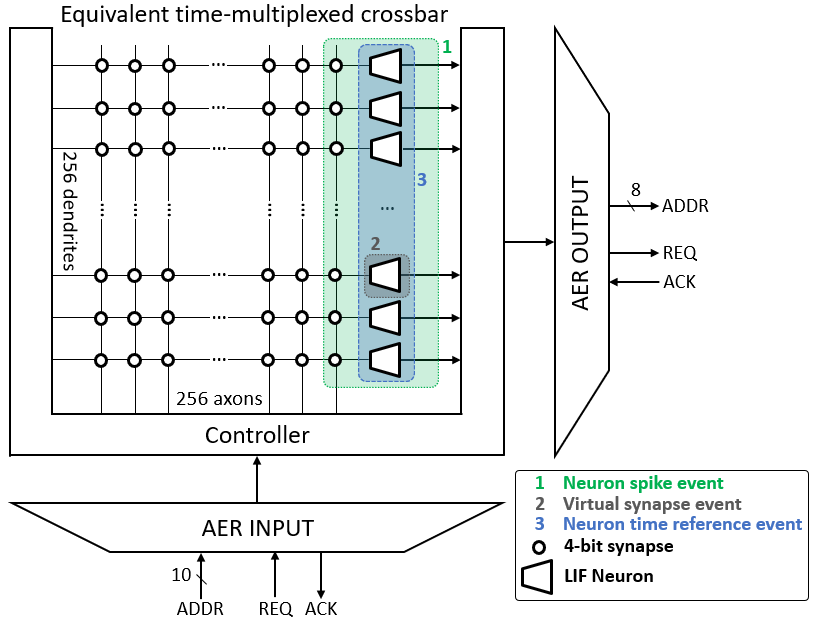
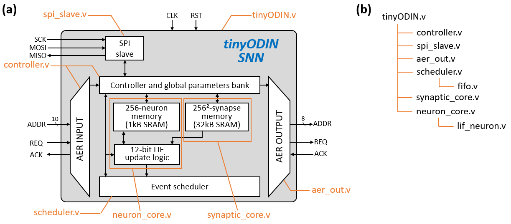
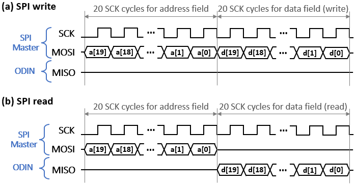
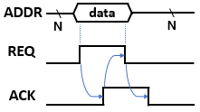
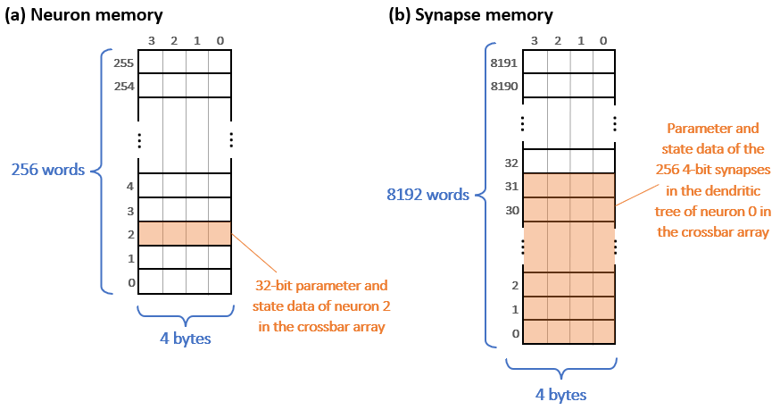

# The tinyODIN Low-Cost Digital Spiking Neural Network (SNN) Processor Documentation

> Copyright (C) 2019-2022, Université catholique de Louvain (UCLouvain, Belgium), University of Zürich (UZH, Switzerland), Katholieke Universiteit Leuven (KU Leuven, Belgium), and Delft University of Technology (TU Delft, Netherlands)

> The documentation for tinyODIN is under a Creative Commons Attribution 4.0 International License (see [doc/LICENSE](LICENSE) file or http://creativecommons.org/licenses/by/4.0/), while the tinyODIN HDL source code is under a Solderpad Hardware License v2.1 (see [LICENSE](../LICENSE) file or https://solderpad.org/licenses/SHL-2.1/).

> 

> Before reading the documentation, it is strongly advised to read the ODIN [*Trans. on BioCAS* paper](#7-citing-tinyodin) in order to have a clear overview of the ODIN SNN.

> **Disclaimer --** Both the HDL code and the documentation of tinyODIN are derived from the [open-source repository of ODIN](https://github.com/ChFrenkel/ODIN).

> Current documentation revision: v1.0.

## Contents

 1. [Architecture](#1-architecture)
 2. [Interfaces and commands](#2-interfaces-and-commands)
 3. [Neuron and synapse operation](#3-neuron-and-synapse-operation)
 4. [Global configuration registers](#4-global-configuration-registers)
 5. [Testbench](#5-testbench)
 6. [Implementation tips](#6-implementation-tips)
 7. [Citing tinyODIN](#7-citing-tinyodin)
 8. [Revision history](#8-revision-history)

## 1. Architecture

tinyODIN is a low-cost spiking neural network (SNN) processor that was reduced to the simplest form of a crossbar array. It is adapted from the open-source ODIN SNN processor, which was published in 2019 in the [*IEEE Transactions on Biomedical Circuits and Systems* journal](#7-citing-tinyodin). tinyODIN embeds 256 12-bit leaky integrate-and-fire (LIF) neurons and 64k 4-bit synapses, whose crossbar architecture and block diagram are described in [Section 1.1](#11-crossbar-architecture) and [Section 1.2](#12-block-diagram-and-file-tree), respectively. As opposed to ODIN, there is no phenomenological Izhikevich neuron model nor online-learning synapses in tinyODIN.

### 1.1. Crossbar architecture

|  |
|:--:|
| *Fig. 1 - tinyODIN time-multiplexed crossbar architecture and key event types handled by the input AER link. Adapted from \[[Frenkel, 2019](#7-citing-tinyodin)\].* |

tinyODIN emulates the crossbar architecture shown in Fig. 1, where each neuron is connected to all 256 neurons in the crossbar array through online-learning synapses. The crossbar core thus comprises 256x256=64k synapses. In order to reduce the circuit resources, the update logic of neurons and synapses is shared through time multiplexing: all the neuron and synapse states are stored in SRAM memories. Input and output events from/to the crossbar architecture are handled through address-event representation (AER) buses.

### 1.2. Block diagram and file tree

|  |
|:--:|
| *Fig. 2 - (a) tinyODIN block diagram with main verilog files, adapted from \[[Frenkel, 2019](#7-citing-tinyodin)\]. (b) Full verilog file tree, illustrating dependencies between the different modules.* |

An overview of the tinyODIN SNN processor block diagram is shown in Fig. 2(a), illustrating the time-multiplexed 256-neuron 64k-synapse crossbar architecture implementation. The individual states and parameters of the neurons and synapses are respectively stored in [1-kB and 32-kB single-port synchronous memories](#31-memory-organization), currently included in the HDL code as a behavioral description (see [Section 5](#6-implementation-tips) for details). Time multiplexing of the neuron and synapse update logic is handled by the controller, while internal and external events from the input AER bus are handled by the scheduler. An SPI bus allows configuring the control registers and accessing the individual neuron and synapse states. The verilog files corresponding to the main blocks are highlighted in orange in Fig. 2(a), while the detailed verilog file tree available in the [src folder](../src/) is shown in Fig. 2(b). Further details regarding the architecture and time-multiplexed operation of tinyODIN can be found in the associated [*Trans. on BioCAS* paper](#7-citing-tinyodin).

## 2. Interfaces and commands

Beyond reset and clock inputs, the top-level file [tinyODIN.v](../src/tinyODIN.v) contains three main interfaces: the SPI bus ([Section 2.1](#21-spi-bus)) and the input and output AER buses ([Section 2.2](#22-address-event-representation-aer-buses)).

### 2.1. SPI bus

|  |
|:--:|
| *Fig. 3 - 20-bit SPI timing diagram for (a) write and (b) read operations.* |

tinyODIN implements a 20-bit slave SPI bus with the following interface:

| Pin    | Direction | Width | Description                            |
|--------|-----------|-------|----------------------------------------|
|*SCK*   | Input     | 1-bit | SPI clock generated by the SPI master. |
|*MOSI*  | Input     | 1-bit | Master output, slave input.            |
|*MISO*  | Output    | 1-bit | Master input, slave output.            |

When using the SPI bus, the *SPI\_GATE\_ACTIVITY* configuration register should be asserted ([Section 4](#4-global-configuration-registers)). In order to ensure proper operation, the SCK SPI clock should operate at a frequency at least 4x smaller than the clock frequency of tinyODIN. The SPI write and read operations follow the timing diagram shown in Figs. 3(a) and 3(b), respectively: a 20-bit address field is first transmitted by the SPI master, before data associated to this address is sent by the master (write) or received from tinyODIN (read). Depending on the contents of the 20-bit address field *a*, the SPI bus can be used to access the [configuration registers](#4-global-configuration-registers), the [neuron memory or the synapse memory](#31-memory-organization) as follows:

| *R* (*a<19>*) | *W* (*a<18>*) | *cmd<1:0>*    (*a<17:16>*) | *addr<15:0>* (*a<15:0>*) | Description                                                                                      |
|------|------|------------|--------------------------------------------|------------------------------------------------------------------------------------------------------------------|
| N/A  | N/A  |     00     | {*conf\_addr<15:0>*}                       | Configuration register write at address *conf\_addr*.                                                            |
|  1   |  0   |     01     | {n/a,*byte\_addr<1:0>*,*word\_addr<7:0>*}  | Read to the neuron memory (256 32-bit words). Byte *byte\_addr<3:0>* from word *word\_addr<7:0>* is retrieved.  |
|  0   |  1   |     01     | {n/a,*byte\_addr<1:0>*,*word\_addr<7:0>*}  | Write to the neuron memory (256 32-bit words). Byte *byte\_addr<3:0>* from word *word\_addr<7:0>* is written.   |
|  1   |  0   |     10     | {n/a,*byte\_addr<1:0>*,*word\_addr<12:0>*} | Read to the synapse memory (8192 32-bit words). Byte *byte\_addr<1:0>* from word *word\_addr<12:0>* is retrieved. |
|  0   |  1   |     10     | {n/a,*byte\_addr<1:0>*,*word\_addr<12:0>*} | Write to the synapse memory (8192 32-bit words). Byte *byte\_addr<1:0>* from word *word\_addr<12:0>* is written.  |

The 20-bit SPI data field *d* has the following form:

| *n/a<3:0>* (*d<19:16>*) | *mask<7:0>* (*d<15:8>*) | *byte<7:0>* (*d<7:0>*) | Source | Description                                                                                            |
|------------|----------------|----------------|------------|----------------------------------------------------------------------------------------------------------------------------------|
|      -     | *w\_mask<7:0>* | *w\_byte<7:0>* | SPI Master |  SPI Write - Data byte *w\_byte<7:0>* masked by *w\_mask<7:0>* (1=masked, 0=non-masked) is written to the target memory location.|
|      -     |      N/A       | *r\_byte<7:0>* | tinyODIN   |  SPI Read - Data byte *r\_byte<7:0>* associated to the target memory location is retrieved from tinyODIN.                            |

### 2.2. Address-event representation (AER) buses

|  |
|:--:|
| *Fig. 4 - AER four-phase handshake timing diagram.* |

Address-event representation (AER) buses follow a four-phase handshake protocol for asynchronous communication between neuromorphic chips, as shown in Fig. 4. As tinyODIN follows a synchronous digital design flow, a double-latching barrier is placed on the *REQ* line of the input AER bus and on the *ACK* line of the output AER bus in order to limit metastability issues. 

### 2.2.1 Input AER bus

The input AER bus has the following interface:

| Pin           | Direction | Width  | Description                     |
|---------------|-----------|--------|---------------------------------|
| *AERIN\_ADDR* | Input     | 10-bit | AER address field.              |
| *AERIN\_REQ*  | Input     | 1-bit  | AER request handshake line.     |
| *AERIN\_ACK*  | Output    | 1-bit  | AER acknowledge handshake line. |

The 10-bit *AERIN\_ADDR* address field accommodates for the following event types, as represented in Fig. 1:

| *ADDR<9>*  | *ADDR<8>* | *ADDR<7:0>*    | Event type                                       | Number of cycles       | Description                                |
|------------|-----------|----------------|--------------------------------------------------|------------------------|--------------------------------------------|
|     1      | 0 | {*w<3:0>*,*neur<3:0>*} | Virtual event                                    | 1+2                    | Stimulates a specific neuron *neur<3:0>* with signed weight *w<3:0>*, without activating a physical synapse. Virtual events go through the scheduler (1 cycle for a push to the scheduler, 2 cycles for processing when the event is popped from the scheduler). |
|     0      | 1 | 0xFF                   | All-neurons time reference event                 | 2*(SPI\_MAX\_NEUR+1)   | Activates a time reference (leakage) event for all activated neurons, as defined by the SPI\_MAX\_NEUR configuration register. |
|     0      | 1 | *neur<7:0>*            | Single-neuron time reference event               | 2                      | Activates a time reference (leakage) event for neuron *neur<7:0>* only (*neur<7:0>* must be different from 0xFF). |
|     0      | 0 | *pre_neur<7:0>*        | Neuron spike event                               | 1+2*(SPI\_MAX\_NEUR+1) | Stimulates all activated neurons, as defined by the SPI\_MAX\_NEUR configuration register, with the synaptic weight associated to pre-synaptic neuron *pre\_neur<7:0>*. Neuron spike events go through the scheduler (1 cycle for a push to the scheduler, up to 512 cycles for processing when the event is popped from the scheduler). |

### 2.2.2. Output AER bus

The output AER bus has the following interface:

| Pin            | Direction | Width  | Description                     |
|----------------|-----------|--------|---------------------------------|
| *AEROUT\_ADDR* | Output    | 8-bit  | AER address field.              |
| *AEROUT\_REQ*  | Output    | 1-bit  | AER request handshake line.     |
| *AEROUT\_ACK*  | Input     | 1-bit  | AER acknowledge handshake line. |

The output AER bus allows sending off-chip events that are generated locally by the neurons in the crossbar array. When a neuron spikes, an output AER transaction is triggered and the 8-bit *AEROUT\_ADDR* address field contains the 8-bit address of the spiking neuron.

## 3. Neuron and synapse operation

As tinyODIN relies on time-multiplexed operation, the memory organization contains essential information for neuron and synapse handling, as shown in Fig. 5 and explained in [Section 3.1](#31-neuron-model) and [Section 3.2](#32-synapse-model), respectively. The word and byte addresses will be used in the commands sent to the [SPI bus](#21-spi-bus) for neuron and synapse configuration and readback operations.

|  |
|:--:|
| *Fig. 5 - (a) Neuron and (b) synapse memory architectures.* |

### 3.1 Neuron model

Fig. 5(a) shows the organization of the neuron memory, which consists of 256 32-bit words. All neurons behave according to a 12-bit leaky integrate-and-fire (LIF) neuron model, whose leakage mechanism is handled in a fully event-driven manner. The state and parameters of each neuron are stored in a single 32-bit word (i.e. the 8-bit word address corresponds to the address of the neuron being accessed) as follows:

| Bitwise location in word | Parameter/state | Name            | Width  | Description                                                                                                     |
|--------------------------|-----------------|-----------------|--------|-----------------------------------------------------------------------------------------------------------------|
| 11-0                     | State           | *core*          | 12     | Contains the current value of the membrane potential. The membrane potential is signed. |
| 23-12                    | Parameter       | *thr*           | 12     | Defines the firing threshold: a spike is issued and the neuron is reset when the membrane potential reaches the *thr* value. |
| 30-24                    | Parameter       | *leak\_str*     | 7      | Defines the fixed amount by which the membrane potential leaks toward zero in the case of time reference / leakage event. |
| 31                       | Parameter       | *neur\_disable* | 1      | Disables the neuron. |

### 3.2 Synapse model

Fig. 5(b) shows the organization of the synapse memory, which consists of 8192 32-bit words. The choice of a 32-bit width was made in order to opt for SRAM macros with the highest density. Each synapse occupies 4 bits, which represent a signed synaptic weight value. 8 synapses are accessed per word and 32 32-bit words are required to encode the dendritic tree of a neuron. A specific synapse corresponds to the intersection of a pre-synaptic neuron (8-bit address *pre\_neur*) and a post-synaptic neuron (8-bit address *post\_neur*); the word and byte addresses of the synapse memory are thus defined as follows:

| Synapse memory address | Width  | Contents                              |
|------------------------|--------|---------------------------------------|
| Word address           | 13-bit | {*pre\_neur<7:0>*,*post\_neur<7:3>*}  |
| Byte address           | 2-bit  | *post\_neur<2:1>*                     |

In the accessed byte, *post\_neur<0>* selects which 4-bit synapse is read or written (0: least-significant half-byte, 1: most-significant half-byte). Such considerations are useful for initial configuration through [SPI](#21-SPI-bus).

### 4. Global configuration registers

Configuration registers can be written through the SPI bus (no readback operation is available) and do not have a default reset value: they need to be programmed after each power cycle and are defined as follows:

| Register Name                  |Addr<15:0>| Width | Description                     | 
|--------------------------------|----------|-------|---------------------------------|
|*SPI\_GATE\_ACTIVITY*           | 0        | 1-bit | Gates the network activity and allows the SPI to access the neuron and synapse memories for programming and readback. |
|*SPI\_OPEN\_LOOP*               | 1        | 1-bit | Prevents spike events generated locally by the neuron array from entering the scheduler, they will thus not be processed by the controller and the scheduler only handles events received from the input AER interface. Locally-generated spike events can still be transmitted via the output AER interface if the *SPI\_AER_SRC\_CTRL\_nNEUR* configuration register is de-asserted. |
|*SPI\_AER\_SRC\_CTRL\_nNEUR*    | 2        | 1-bit | Defines the source of the AER output events when a neuron spikes, either directly from the neuron when the event is generated (0) or from the controller when the event is processed (1). This distinction is of importance especially if *SPI\_OPEN\_LOOP* is asserted. |
|*SPI\_MAX\_NEUR*                | 3        | 8-bit | Defines the maximum neuron index to be processed, i.e. the crossbar array size. This parameter is useful to avoid processing dummy synaptic operations in case the neuron resources actually being used are small. |

## 5. Testbench

A simple testbench file demonstrating online learning is provided (see [tbench.sv](../src/tbench.sv)). It contains a few routines to write, read, and verify the contents of the neuron and synapse memories via SPI, as well as system-level checks for the open- and closed-loop configurations, as defined by *SPI\_OPEN\_LOOP*.

## 6. Implementation tips

When implementing tinyODIN or adapting it for a particular application, care should be taken with the following points:

* The provided verilog code can directly be simulated with behavioral simulation. For implementation, the behavioral descriptions of the neuron and synapse single-port synchronous SRAMs (in [neuron\_core.v](../src/neuron_core.v) and in [synaptic\_core.v](../src/synaptic_core.v), respectively) need to be replaced with SRAM macros. Block RAM (BRAM) instances can be used for FPGA implementations.

* The different verilog modules contain as parameters N and M, where N represents the number of neurons in the crossbar array and M is log2(N). These parameters help rescaling tinyODIN to different crossbar dimensions (e.g., see [here](https://arxiv.org/pdf/1904.08513.pdf) the example of MorphIC, our second neuromorphic processor with 512 neurons per core), however the datapath is not entirely generic in N and M and further adaptations are needed if the crossbar dimensions are changed.

* The neuron disable bit (i.e. the MSB of each word in the neuron memory, cfr. [Section 3.1](#31-memory-organization)) only disables the spike generation mechanism. This feature is useful if one wants to monitor the state of a neuron while disabling its contributions to network activity. However, if the disabled neuron is unused, it comes at the cost of a power overhead as the update logic and memory accesses are not disabled: an update in the controller finite-state-machine is required to alleviate this behavior.

* An SDC constraints file is provided to ease porting ODIN to ASIC/FPGA designs. Numeric values and boundary conditions need to be updated for your own use case.

## 7. Citing tinyODIN

Upon usage of the documentation or source code, please cite the *Trans. on BioCAS* paper (also available [here](https://arxiv.org/pdf/1804.07858.pdf)) associated to the original ODIN design:

> C. Frenkel, M. Lefebvre, J.-D. Legat and D. Bol, "A 0.086-mm² 12.7-pJ/SOP 64k-Synapse 256-Neuron Online-Learning Digital Spiking Neuromorphic Processor in 28-nm CMOS," IEEE Transactions on Biomedical Circuits and Systems, vol. 13, no. 1, pp. 145-158, 2019.

## 8. Revision history

| Rev    | Date         | Author     | Description                           |
|--------|--------------|------------|---------------------------------------|
|  1.0   | 30 July 2022 | C. Frenkel | First draft                           |

